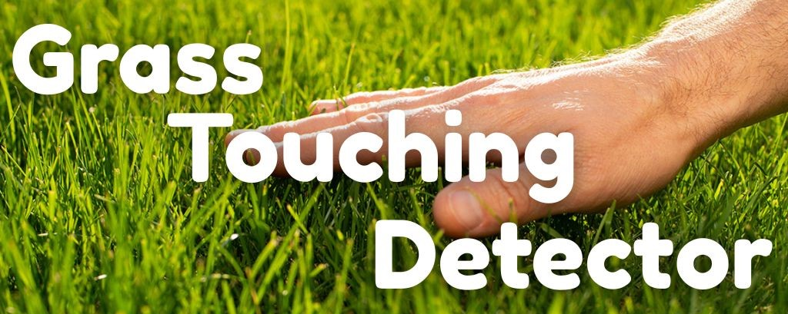
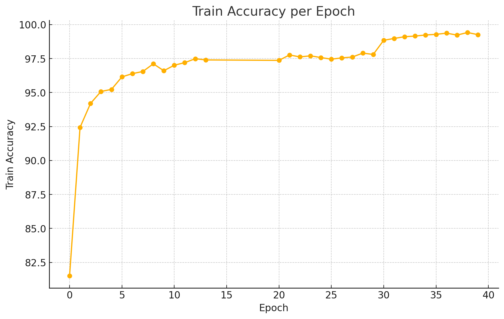
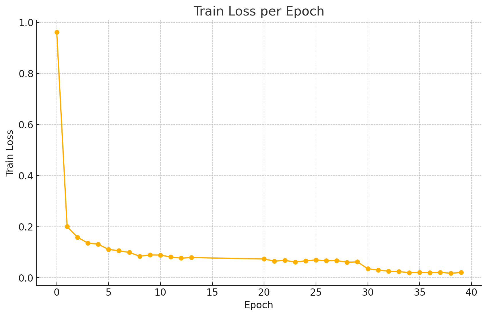
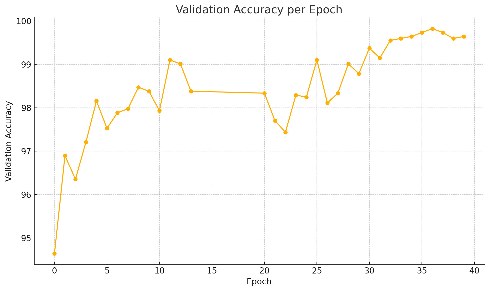
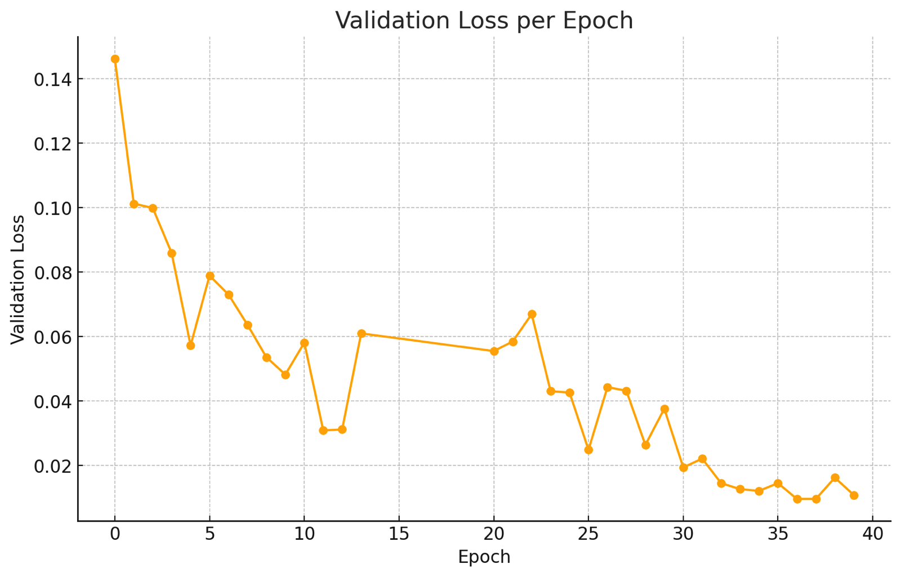

This is an AI that can determine whether or not are you touching grass. My inspiration when creating this project was a popular [meme](https://knowyourmeme.com/memes/touch-grass) from the internet, where people jokingly tell each other to "go outside and touch grass" when they’re spending too much time on the computer.

## Inference

Clone the repository:

```bash
git clone https://github.com/marks0kolov/touch_grass.git
cd touch_grass
```
Install the required packages

```bash
pip3 install scripts/requirements.txt
```

Run inference on an image with the provided python script:

```bash
python3 scripts/check_touching_grass.py path_to_image.jpg models/grassNet/model.onnx models/poseNet/model.onnx
```

(don't forget to replace `path_to_image` with the actual path to image)

The script will load both ONNX models, use both of them to check if the image contains grass and a hand and print the result. To check for only grass or hands run `scripts/check_grass.py` and `scripts/check_hand.py` accordingly.

## GUI

The AI also has a GUI with a timer that can remind you to touch grass from time to time and check if you've really done it.<br> You can set a timer:<br>
<br>
And then when it finishes the program will ask you to upload a photo of you touching grass:<br>
<br>
The AI will then recognize whether or not you uploaded a real photo and not stop the alarm until you uploaded a real photo of you touching grass<br>
<div style="display:flex; flex-direction:row;align-items:flex-start;">
 
 
</div>
After that the timer setting page will appear again.<br>
To use the interface, you need to run a local server from the root of the project with

```bash
python3 -m http.server 1008 --directory gui/
```

and then navigate to http://localhost:1008

## Training

Firstly, I took 10.5k images of grass from various datasets on the internet (more info in [resources](#resources)). Then i added an image of a hand to 80% of those images, so that the model also accepts images with hands covering some part of it. I also downloaded 10k of indoor images from the Places365 dataset.<br>
Secondly, using the [`train.py`](https://github.com/dusty-nv/pytorch-classification/blob/3e9cf8c4003311009539a6c101d156c919fe2250/train.py) script from the [jetson-inference GitHub repo](https://github.com/dusty-nv/jetson-inference), I fine‑tuned an Image  ResNet‑18 on this dataset for 40 epochs. The best model with an accuracy of 99.82% and a loss of ~0.009 on the validation images was the  checkpoint from epoch 36, so i took it as the main model.<br>

<div style="overflow: hidden; margin-bottom: 10px;">
  
  
</div>
<div style="overflow: hidden;">
  
  
</div>
<br>
I also took the original Pose ResNet-18 Hand ONNX model from the jetson-inference repository to detect hands on images.

## Resources

- Datasets
    - Deep Learning. 2025. *"Capstone Project – Grass Species."* Roboflow Universe. Roboflow, Inc.  https://universe.roboflow.com/deep-learning-4rbtb/capstone-project-grass-species
    - Iowa State University. 2024. *"Grass O0vum v1."* Roboflow Universe. Roboflow, Inc. https://universe.roboflow.com/iowa-state-university-krhld/grass-o0vum
    - Usharengaraju. n.d. *"GrassClover Dataset."* Kaggle. Accessed July 24, 2025. https://www.kaggle.com/datasets/usharengaraju/grassclover-dataset
    - Timofeymoiseev. n.d. *"Grass Detection Dataset."* Kaggle. Accessed July 24, 2025. https://www.kaggle.com/datasets/timofeymoiseev/grass
    - Jonasdahlqvist. n.d. *"Grass‑NoGrass Dataset."* Kaggle. Accessed July 24, 2025. https://www.kaggle.com/datasets/jonasdahlqvist/grass-nograss-dataset
    - CSAILVision. 2017. *"Places365‑CNNs for Scene Classification"*. GitHub. https://github.com/CSAILVision/places365.  Accessed July 24, 2025.

- Models
    - Image ResNet-18
    - Pose ResNet-18

- NVIDIA Jetson Orin Nano

- [jetson-inference GitHub repo](https://github.com/dusty-nv/jetson-inference)
